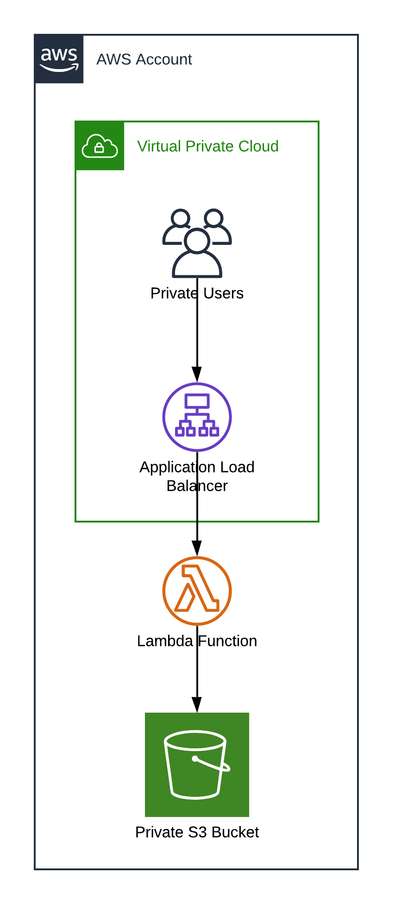

# Lambda-based proxy for AWS S3 via Application Load Balancer
This is a simple example for using Lambda and Application Load Balancer as a proxy for S3. This is especially useful when you need the S3 Bucket to:
    1. Behave like a normal website, e.g. for a Single-Page Application
    2. Have a traffic path that is entirely internal to your VPC or wider internal network

## Configuration
A simple mapping is configured in `src/mappings.json` to point a requested Host to a given bucket. See the file for an example. When the Application Load Balancer receives a request for a given Host, the Lambda will check the mapping file and attempt to request the supplied Path in the mapped S3 Bucket.

## Architecture

